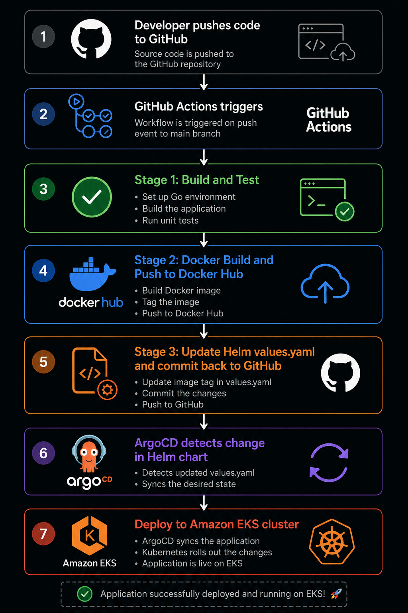
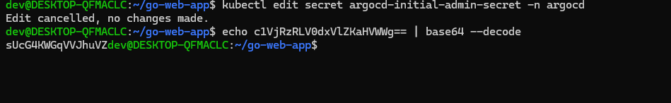
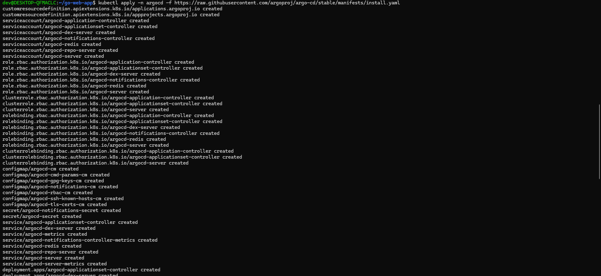
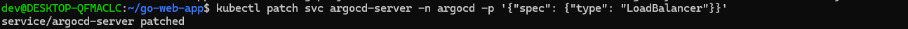
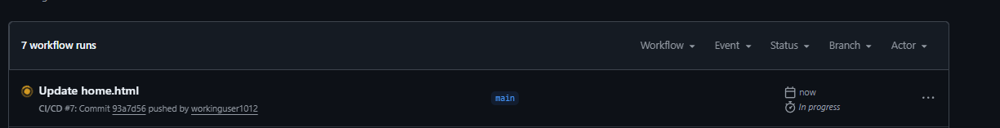
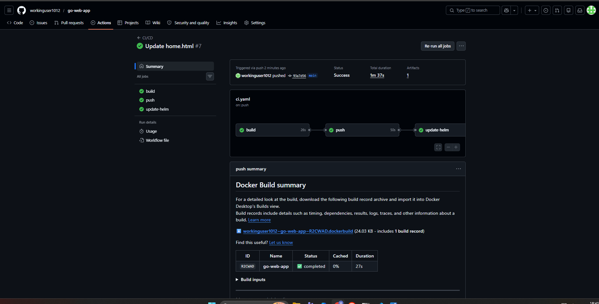
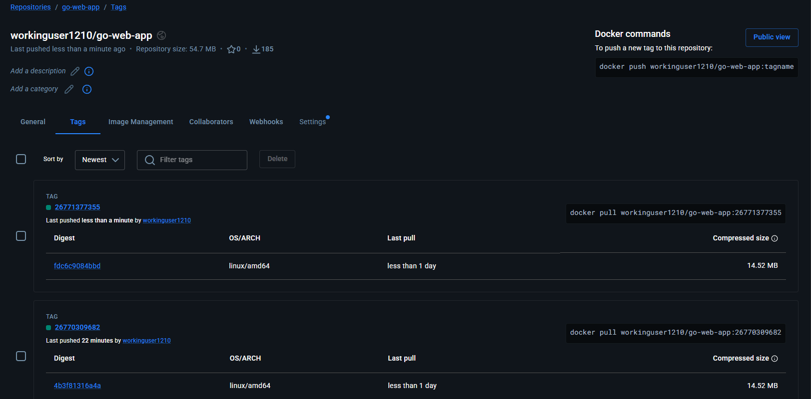
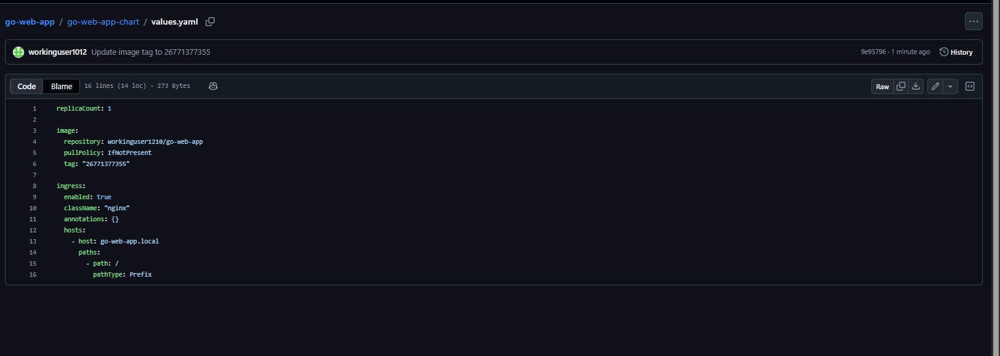
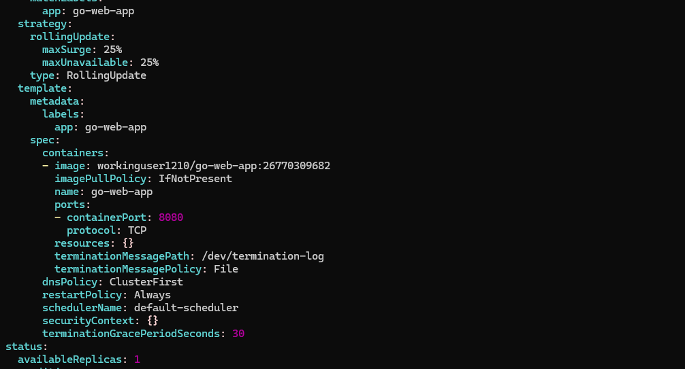
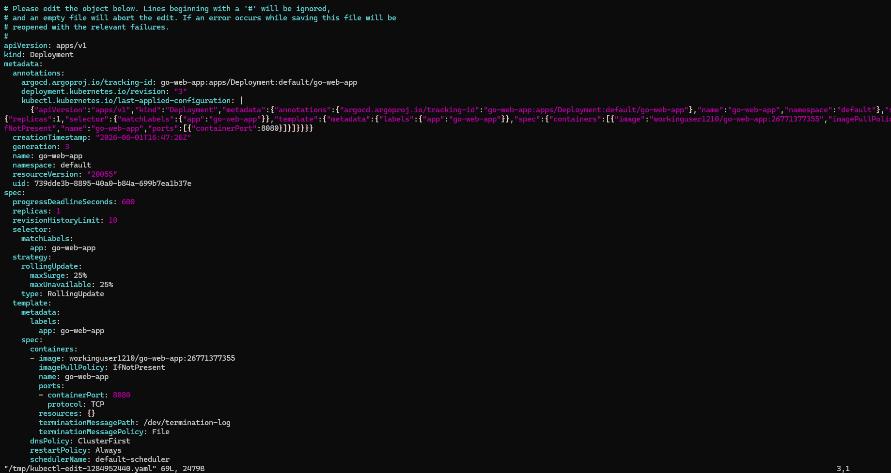

# Go Web App

A lightweight, multi-page web app I built with pure Go — Containerised and deployed to Amazon EKS.

<p align="center">
  
</p>


## How It Works ( Final Structure)
 
I built a multi-page web app in Go with four pages — home, about, contact, and a health check endpoint. It's containerised with Docker and the image is stored on Docker Hub. The app runs on Amazon EKS with two t3.small nodes created using eksctl, exposed publicly through an AWS Elastic Load Balancer.
 
When I push code to main, GitHub Actions picks up the pipeline from `.github/workflows/ci.yml` and runs automatically. First it runs `go test ./...` to make sure nothing is broken — if tests fail everything stops there. If they pass it builds a fresh Docker image and pushes it to Docker Hub with a unique tag using the GitHub run ID. Once that's done it updates the image tag in `go-web-app-chart/values.yaml` and commits that change back to the repo.
 
Rather than managing raw Kubernetes files manually, everything is packaged into a Helm chart. The `templates/` folder contains the deployment, service, and ingress files and `values.yaml` is the only thing that changes between deployments — just the image tag.
 
ArgoCD runs inside the EKS cluster watching the repo. The moment it sees `values.yaml` change it pulls the updated Helm chart and deploys it automatically. First time it runs `helm install`, after that every update is a `helm upgrade` with zero downtime. The cluster is never touched manually.
 

## Pages

- `/` — Home
- `/about` — About
- `/contact` — Contact
- `/health` — Health check endpoint (returns `{"status":"ok"}`)

## Prerequisites

Before deploying, make sure you have the following installed and configured:

- [Go 1.21+](https://golang.org/dl/)
- [Docker](https://docs.docker.com/get-docker/)
- [kubectl](https://kubernetes.io/docs/tasks/tools/)
- [AWS CLI](https://aws.amazon.com/cli/) — configured with `aws configure`
- [eksctl](https://eksctl.io/) — used to create and manage the EKS cluster
- [Helm](https://helm.sh/docs/intro/install/) — used to package and deploy the application
- [ArgoCD](https://argo-cd.readthedocs.io/en/stable/getting_started/) — used for continuous delivery to EKS
-  [Docker Hub](https://hub.docker.com/) account — to push and store Docker images
-  [GitHub](https://github.com/) account — for source control and GitHub Actions CI pipeline

( Dont panick I will show you when each is needed and how to download it,its very simple.)
## Project Structure

```
.
├── Dockerfile
├── README.md
├── assets/
├── deployment.yaml
├── go-web-app-chart
│   ├── Chart.yaml
│   ├── charts/
│   ├── templates
│   │   ├── deployment.yaml
│   │   ├── ingress.yaml
│   │   └── service.yaml
│   └── values.yaml
├── go.mod
├── k8s
│   └── manifests
│       ├── deployment.yaml
│       ├── ingress.yaml
│       └── service.yaml
├── main
├── main.go
├── static
│   └── style.css
└── templates
    ├── about.html
    ├── base.html
    ├── contact.html
    └── home.html


```

## Run locally

```bash
go run .
```

## Run with Docker

```bash
docker build -t go-web-app .
docker run -p 8080:8080 go-web-app
```

<p align="center">
  
</p>

<p align="center">
  
</p>


## Devopsifying the Project

After Running with Docker , The Image has to be pushed to a registory

```
docker push workinguser1210/go-web-app:v1
```
## Deployment — Amazon EKS

This app is deployed to a Kubernetes cluster running on Amazon EKS.

## Create the EKS cluster

<p align="center">
  
</p>
<p align="center">
  
</p>


```bash
eksctl create cluster --name cluster1 --region us-east-1 --node-type t3.small --nodes 2
kubectl apply -f k8s/manifests/deployment.yaml
kubectl apply -f k8s/manifests/service.yaml
kubectl apply -f k8s/manifests/ingress.yaml
```

## Debugging and Deploying to EKS

I deployed the app to the EKS cluster by applying the Kubernetes manifests. I changed the service type to NodePort so I could access the app externally through the node's external IP. The app still wasn't accessible so I went into the EC2 security group in the AWS console and added an inbound rule to open port 32405 to the internet. After that I could access the app through the node's public IP.
(You can access your app through the external IP provided when you run "kubectl get nodes -o wide" and the port provided when you run "kubectl get svc" eg http://54.89.21.38:32405/  )

<p align="center">
  
</p>
<p align="center">
  
</p>
<p align="center">
  
</p>
<p align="center">
  
</p>

```
kubectl edit svc go-web-app
kubectl get nodes -o wide
```

## Create a NGINX Controller and Setup routing rules/DNS Mapping
```bash
kubectl apply -f https://raw.githubusercontent.com/kubernetes/ingress-nginx/controller-v1.11.1/deploy/static/provider/aws/deploy.yaml
KUBE_EDITOR="nano" kubectl edit ingress go-web-app
```
Add ingressClassName: nginx under Spec 

``` bash
kubectl get ingress
nslookup ad02fcd29cec94300aa7c48f1a306010-53f435e8b3e70273.elb.us-east-1.amazonaws.com
sudo nano /etc/hosts
```
Take the ip adress from  the ns look up command and write it in your /etc/hosts along with the host from ingress.yaml. (ps some of these commands are catered to my setup so just replace the IP and etc)

<p align="center">
  
</p>

<p align="center">
  
</p>

<p align="center">
  
</p>

<p align="center">
  
</p>

<p align="center">
  
</p>


 
## Helm Deployment
 
Instead of managing individual Kubernetes YAML files, I packaged the entire application into a Helm chart. This allowed me to manage the deployment, service, and ingress as a single unit rather than applying each file separately.
 
### 1. Install Helm
 
I first installed Helm on my machine. You can follow the official install guide at https://helm.sh/docs/intro/install/
 
### 2. Create the Helm Chart
 
I created a new Helm chart using:
 
```bash
helm create go-web-app-chart
```
 
I then removed all the default template files that Helm generates, as I wanted to use my own:
 
```bash
rm -rf go-web-app-chart/templates/*
```

<p align="center">
  
</p>
 
### 3. Copy Manifests into the Chart
 
I copied my existing Kubernetes manifests into the templates folder:
 
```bash
cp -i k8s/manifests/deployment.yaml go-web-app-chart/templates/
cp -i k8s/manifests/service.yaml go-web-app-chart/templates/
cp -i k8s/manifests/ingress.yaml go-web-app-chart/templates/
```
 
<p align="center">
  
</p>

### 4. Configure the Chart
 
I updated the YAML files inside `templates/` so they reference values from each other, and deleted the default `values.yaml` so the templates use their own hardcoded values directly.
 
<p align="center">
  
</p>
<p align="center">
  
</p>
<p align="center">
  
</p>
<p align="center">
  
</p>

### 5. Delete Existing Resources
 
Before installing via Helm I cleaned up the manually applied resources:
 
```bash
kubectl delete deploy go-web-app
kubectl delete svc go-web-app
kubectl delete ing go-web-app
```
 
<p align="center">
  
</p>

### 6. Install with Helm
 
I then installed the app through Helm from the project root:
 
```bash
cd ~/go-web-app
helm install go-web-app ./go-web-app-chart
```
 
Verify everything is running:
 
```bash
helm list
kubectl get all
```
 
<p align="center">
  
</p>

### 7. Uninstall
 
To tear down the entire release in one command:
 
```bash
helm uninstall go-web-app
```
 
This removes the deployment, service, and ingress all at once — no need to delete each resource manually like before.
 
<p align="center">
  
</p>


## CI/CD Pipeline

This project uses GitHub Actions for CI and ArgoCD for CD.

### Overview

<p align="center">
  
</p>


### CI — GitHub Actions

The CI pipeline is defined in `.github/workflows/ci.yml` and runs automatically on every push to `main`.


## Secrets Required

Before the pipeline will run, add these secrets to your GitHub repository

`DOCKERHUB_USERNAME`  Your Docker Hub username 

`DOCKERHUB_TOKEN`  Docker Hub access token 

`TOKEN`  GitHub personal access token for committing back to the repo 

#### Stage 1 — Build and Test

Checks out the code, sets up Go, and runs unit tests to make sure nothing is broken before anything gets built or deployed.


#### Stage 2 — Docker Build and Push

Builds a new Docker image and pushes it to Docker Hub using the GitHub Actions run ID as the image tag, so every push produces a unique version.


#### Stage 3 — Update Helm

Updates the image tag in `values.yaml` with the new tag from Stage 2 and commits that change back to the repository. This is what triggers the CD stage.


---

<p align="center">
  
</p>


### CD — ArgoCD

ArgoCD runs inside the EKS cluster and watches the Helm chart When it detects a change to `values.yaml` it automatically pulls the updated chart and deploys it to the cluster.


## Install 
Steps on how to install argocd ,access the ui through a loadbalancer 
```bash
kubectl create namespace argocd
kubectl apply -n argocd -f https://raw.githubusercontent.com/argoproj/argo-cd/stable/manifests/install.yaml
kubectl patch svc argocd-server -n argocd -p '{"spec": {"type": "LoadBalancer"}}'
kubectl get svc argocd-server -n argocd
```
When Accessing argocd ,username is admin and password can be found by running "kubectl edit secret argocd-initial-admin-secret -n argocd" and then copying the password into this command "echo password | base64 --decode"( replace password with your password).

<p align="center">
  
</p>


## Implementation

<p align="center">
  
</p>
<p align="center">
  
</p>
<p align="center">
  
</p>


## Final Demo
 
To see the full CI/CD pipeline in action, make a change to `templates/home.html` and push it to main.
 
```bash
git add .
git commit -m "Update home page"
git push origin main
```
 
This single push triggers the entire pipeline automatically:
 
1. **GitHub Actions kicks off** — runs the build and test stage to make sure nothing is broken

<p align="center">
  
</p>
<p align="center">
  
</p>


2. **Docker image is built and pushed** to Docker Hub with a new unique tag

<p align="center">
  
</p>

3. **values.yaml is updated** with the new image tag and committed back to the repo

<p align="center">
  
</p>

4. **ArgoCD detects the change** in the Helm chart and automatically deploys the new version to EKS
You never touch the cluster — by the time you check the ArgoCD UI the new version is already live.

<p align="center">
  
</p>
<p align="center">
  
</p>