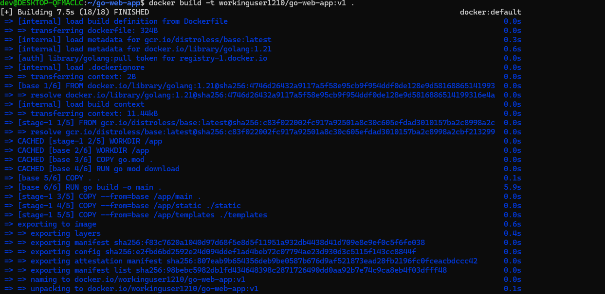
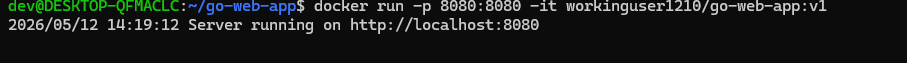
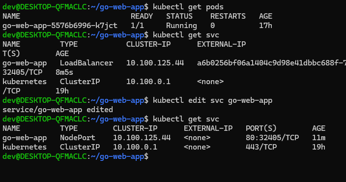
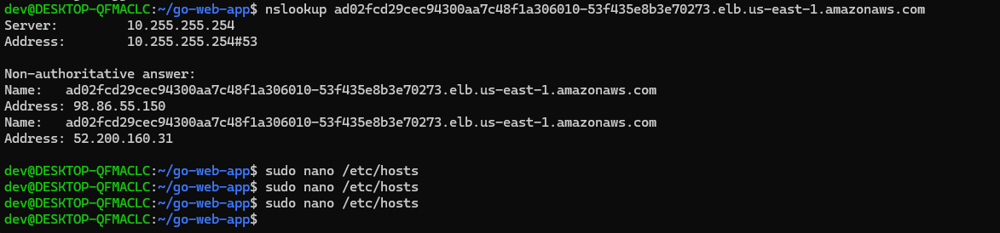

# Go Web App

A lightweight, multi-page web app I built with pure Go — Containerised and deployed to Amazon EKS.

<p align="center">
  
</p>

## Pages

- `/` — Home
- `/about` — About
- `/contact` — Contact
- `/health` — Health check endpoint (returns `{"status":"ok"}`)

## Prerequisites

Before deploying, make sure you have the following installed and configured:

- [Go 1.21+](https://golang.org/dl/)
- [Docker](https://docs.docker.com/get-docker/)
- [kubectl](https://kubernetes.io/docs/tasks/tools/)
- [AWS CLI](https://aws.amazon.com/cli/) — configured with `aws configure`
- [eksctl](https://eksctl.io/) — used to create and manage the EKS cluster

## Project Structure

```
go-web-app/
├── main.go
├── go.mod
├── Dockerfile
├── k8s/
│   ├── deployment.yaml
│   ├── service.yaml
│   └── ingress.yaml
├── templates/
│   ├── base.html
│   ├── home.html
│   ├── about.html
│   └── contact.html
└── static/
    └── style.css
```

## Run locally

```bash
go run .
```

## Run with Docker

```bash
docker build -t go-web-app .
docker run -p 8080:8080 go-web-app
```

<p align="center">
  
</p>

<p align="center">
  
</p>


## Devopsifying the Project

After Running with Docker , The Image has to be pushed to a registory

```
docker push workinguser1210/go-web-app:v1
```
## Deployment — Amazon EKS

This app is deployed to a Kubernetes cluster running on Amazon EKS.

## Create the EKS cluster

<p align="center">
  
</p>
<p align="center">
  
</p>


```bash
eksctl create cluster --name cluster1 --region us-east-1 --node-type t3.small --nodes 2
kubectl apply -f k8s/manifests/deployment.yaml
kubectl apply -f k8s/manifests/service.yaml
kubectl apply -f k8s/manifests/ingress.yaml
```

## Debugging and Deploying to EKS

I deployed the app to the EKS cluster by applying the Kubernetes manifests. I changed the service type to NodePort so I could access the app externally through the node's external IP. The app still wasn't accessible so I went into the EC2 security group in the AWS console and added an inbound rule to open port 32405 to the internet. After that I could access the app through the node's public IP.
(You can access your app through the external IP provided when you run "kubectl get nodes -o wide" and the port provided when you run "kubectl get svc" eg http://54.89.21.38:32405/  )

<p align="center">
  
</p>
<p align="center">
  
</p>
<p align="center">
  
</p>
<p align="center">
  
</p>

```
kubectl edit svc go-web-app
kubectl get nodes -o wide
```

## Create a NGINX Controller and Setup routing rules/DNS Mapping
```bash
kubectl apply -f https://raw.githubusercontent.com/kubernetes/ingress-nginx/controller-v1.11.1/deploy/static/provider/aws/deploy.yaml
KUBE_EDITOR="nano" kubectl edit ingress go-web-app
```
Add ingressClassName: nginx under Spec 

``` bash
kubectl get ingress
nslookup ad02fcd29cec94300aa7c48f1a306010-53f435e8b3e70273.elb.us-east-1.amazonaws.com
sudo nano /etc/hosts
```
Take the ip adress from  the ns look up command and write it in your /etc/hosts along with the host from ingress.yaml. (ps some of these commands are catered to my setup so just replace the IP and etc)

<p align="center">
  
</p>
<p align="center">
  
</p>
<p align="center">
  
</p>
<p align="center">
  
</p>
<p align="center">
  
</p>
<p align="center">
  
</p>
<p align="center">
  
</p>
<p align="center">
  
</p>
<p align="center">
  
</p>
<p align="center">
  
</p>


# Go Web App
 
## Helm Deployment
 
Instead of managing individual Kubernetes YAML files, I packaged the entire application into a Helm chart. This allowed me to manage the deployment, service, and ingress as a single unit rather than applying each file separately.
 
### 1. Install Helm
 
I first installed Helm on my machine. You can follow the official install guide at https://helm.sh/docs/intro/install/
 
### 2. Create the Helm Chart
 
I created a new Helm chart using:
 
```bash
helm create go-web-app-chart
```
 
I then removed all the default template files that Helm generates, as I wanted to use my own:
 
```bash
rm -rf go-web-app-chart/templates/*
```

<p align="center">
  
</p>
<p align="center">
  
</p>
 
### 3. Copy Manifests into the Chart
 
I copied my existing Kubernetes manifests into the templates folder:
 
```bash
cp -i k8s/manifests/deployment.yaml go-web-app-chart/templates/
cp -i k8s/manifests/service.yaml go-web-app-chart/templates/
cp -i k8s/manifests/ingress.yaml go-web-app-chart/templates/
```
<p align="center">
  
</p>
<p align="center">
  
</p>
 
### 4. Configure the Chart
 
I updated the YAML files inside `templates/` so they reference values from each other, and deleted the default `values.yaml` so the templates use their own hardcoded values directly. ()
 
 <p align="center">
  
</p>
<p align="center">
  
</p>
<p align="center">
  
</p>
<p align="center">
  
</p>
</p>
<p align="center">
  
</p>

### 5. Delete Existing Resources
 
Before installing via Helm I cleaned up the manually applied resources:
 
```bash
kubectl delete deploy go-web-app
kubectl delete svc go-web-app
kubectl delete ing go-web-app
```
<p align="center">
  
</p>

### 6. Install with Helm
 
I then installed the app through Helm from the project root:
 
```bash
cd ~/go-web-app
helm install go-web-app ./go-web-app-chart
```
 
Verify everything is running:
 
```bash
helm list
kubectl get all
```
 <p align="center">
  
</p>

### 7. Uninstall
 
To tear down the entire release in one command:
 
```bash
helm uninstall go-web-app
```
 
This removes the deployment, service, and ingress all at once — no need to delete each resource manually like before.

<p align="center">
  
</p>


